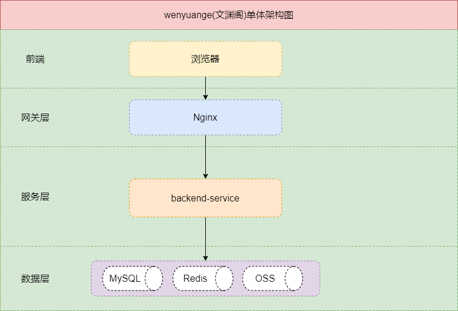
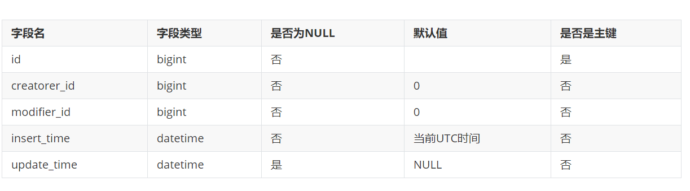

# wenyuange

wenyuange(文渊阁)是一个博客系统,名字来自于明朝皇家藏书楼名,希望博客系统能沉淀有用的知识.

## 功能

- [] 在线markdown编辑，图片传到腾讯云等对象存储
- [] 文章内容发布到多个平台，如知乎，掘金，CSDN，多个平台配置设置
- [] 配置管理，包括图床配置，第三方账号配置
- [] 博客内容加密
- [] 前后端分离
- [] 话题管理
- [] 标签管理 
- [] 评论管理,评论对接第三方,(类似多说,或者github,邮箱),评论要防止恶意刷屏,限制发帖
- [] 文章管理, 一个文章可以有多个话题,多个标签, 阅读数量,点赞数量, 点赞,文章可以置顶
- [] 友链管理
- [] 推广管理(优先级低)
- [] 文章底部公共配置,设置二维码或公众号
- [] 后台管理
- [] API管理,swagger或openapi
- [] 权限验证 
- [] 参数校验
- [] 支持docker部署
- [] 支持自动化部署

## 需求描述

### 前端

前端页面可以查看标签,查看话题,查看文章列表,查看文章详情,文章详情页面可以点赞,评论,可以查看阅读数量,点赞数量.

- 首页显示文章列表,文章按照时间优先级,时间降序排列.
- 标签页面:显示所有的标签,显示成类似词云效果
- 话题页面:显示所有的话题,显示成类似词云效果
- 关于页面:显示个人介绍的内容
- 归档页面:按照时间降序分页显示所有内容
- 前端还应该支持查询功能,模糊匹配标签,话题,内容

### 后端

后端管理页面最重要的功能是对博客进行编辑发布.

- 权限验证: 需要登录之后才能进入后台页面
- 编辑设置: markdown编辑配置,如图床等配置
- 配置管理: 配置第三方账户, 设置文章底部配置, 友链配置, 推广配置
- 标签管理: 增删改查标签
- 话题管理: 增删改查话题
- 评论管理: 增删改查评论
- 文章管理: 增删改查文章
- 其他功能: 
- - API管理
- - 自动部署

## 需求分析

## 产品设计

## 架构设计

采用B/S架构,分层架构 

单体架构如下图

## 详细设计

### 数据库表设计

每个表都包含以下字段, 后面不在赘述.

